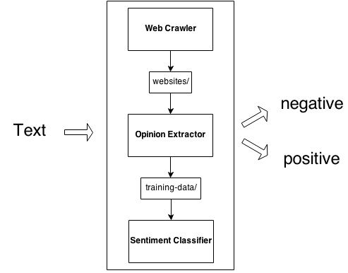

# Opinion mining
Opinion mining using information placed at web pages like Ceneo, eBay etc.
This applications uses sentiment analysis to answer if given text is positive or negative.

## Usage
To run an application it is not necessary to build it on your own. You can use following jar: opinion-mining-1.0-all.jar
which is placed in lib/ directory.

```$ java -jar lib/opinion-mining-1.0-all.jar –useTrainingData training-data/ -train -classify "Super książka! Polecam!"```

Available arguments:
* `-collectData` runs web crawler and donwloads web pages to tmp/
* `-useTrainingData PATH_TO_TRAINING_DATA`
* `-train`
* `-classify TEXT_TO_CLASSIFY`

## Architecture

